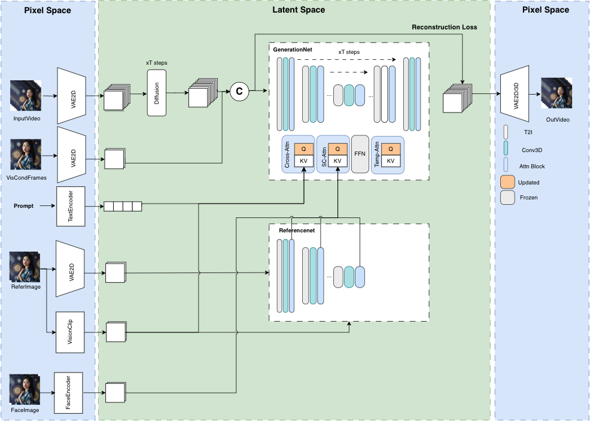
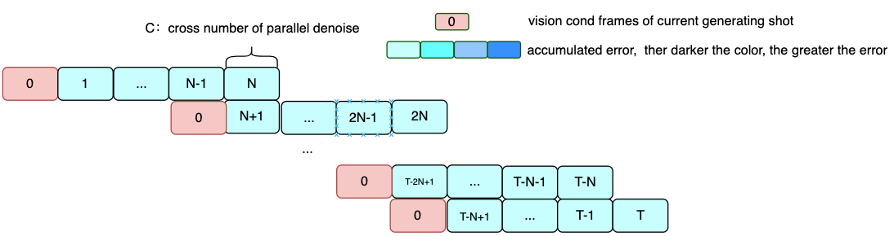

# MuseV

<font size=5>MuseV: Infinite-length and High Fidelity Virtual Human Video Generation with Visual Conditioned  Parallel Denoising
</br>
Zhiqiang Xia <sup>\*</sup>,
Zhaokang Chen<sup>\*</sup>,
Bin Wu<sup>†</sup>,
Chao Li,
Kwok-Wai Hung,
Chao Zhan,
Yingjie He, 
Wenjiang Zhou
(<sup>*</sup>co-first author, <sup>†</sup>Corresponding Author, benbinwu@tencent.com)
</font>

**[github](https://github.com/TMElyralab/MuseV)**    **[huggingface](https://huggingface.co/TMElyralab/MuseV)**    **[project](comming soon)**    **Technical report (comming soon)**


We have setup **the world simulator vision since March 2023, believing diffusion models can simulate the world**. `MuseV` was a milestone achieved around **July 2023**. Amazed by the progress of Sora, we decided to opensource `MuseV`, hopefully it will benefit the community. Next we will move on to the promising diffusion+transformer scheme.

We will soon release `MuseTalk`, a real-time high quality lip sync model, which can be applied with MuseV as a complete virtual human generation solution. Please stay tuned! 

# Overview
`MuseV` is a diffusion-based virtual human video generation framework, which 
1. supports **infinite length** generation using a novel **Visual Conditioned Parallel Denoising scheme**.
2. checkpoint available for virtual human video generation trained on human dataset.
3. supports Image2Video, Text2Image2Video, Video2Video.
4. compatible with the **Stable Diffusion ecosystem**, including `base_model`, `lora`, `controlnet`, etc. 
5. supports multi reference image technology, including `IPAdapter`, `ReferenceOnly`, `ReferenceNet`, `IPAdapterFaceID`.
6. training codes (comming very soon).


# News
- [03/27/2024] release `MuseV` project and trained model `musev`, `muse_referencenet`.

## Model
### Overview of model structure

### Parallel denoising


## Cases
All frames were generated directly from text2video model, without any post process.
<!-- # TODO: // use youtu video link? -->
Examples bellow can be accessed at `configs/tasks/example.yaml`
### Text/Image2Video

#### Human

<table class="center">
  <tr style="font-weight: bolder;text-align:center;">
        <td width="50%">image</td>
        <td width="45%">video </td>
        <td width="5%">prompt</td>
  </tr>

  <tr>
    <td>
      
    </td>
    <td >
     <video src="https://github.com/TMElyralab/MuseV/assets/163980830/732cf1fd-25e7-494e-b462-969c9425d277" width="100" controls preload></video>
    </td>
    <td>(masterpiece, best quality, highres:1),(1girl, solo:1),(beautiful face,
    soft skin, costume:1),(eye blinks:{eye_blinks_factor}),(head wave:1.3)
    </td>
  </tr>

  <tr>
    <td>
      
    </td>
    <td>
     <video src="https://github.com/TMElyralab/MuseV/assets/163980830/62b533d3-95f3-48db-889d-75dde1ad04b7" width="100" controls preload></video>
    </td>
    <td>
    (masterpiece, best quality, highres:1),(1girl, solo:1),(beautiful face,
    soft skin, costume:1),(eye blinks:{eye_blinks_factor}),(head wave:1.3)
    </td>
  </tr>

  <tr>
    <td>
      
    </td>
    <td>
      <video src="https://github.com/TMElyralab/MuseV/assets/163980830/9b75a46c-f4e6-45ef-ad02-05729f091c8f" width="100" controls preload></video>
    </td>   
    <td>
    (masterpiece, best quality, highres:1), peaceful beautiful sea scene
    </td>
  </tr>
  <tr>
    <td>
      
    </td>
    <td>
      <video src="https://github.com/TMElyralab/MuseV/assets/163980830/d0f3b401-09bf-4018-81c3-569ec24a4de9" width="100" controls preload></video>
    </td>
    <td>
      (masterpiece, best quality, highres:1), peaceful beautiful sea scene
    </td>
  </tr>
  <!-- guitar  -->
  <tr>
    <td>
      
    </td>
    <td>
      <video src="https://github.com/TMElyralab/MuseV/assets/163980830/61bf955e-7161-44c8-a498-8811c4f4eb4f" width="100" controls preload></video>
    </td>
    <td>
       (masterpiece, best quality, highres:1), playing guitar
    </td>
  </tr>
  <tr>
    <td>
      
    </td>
    <td>
      <video src="https://github.com/TMElyralab/MuseV/assets/163980830/40982aa7-9f6a-4e44-8ef6-3f185d284e6a" width="100" controls preload></video>
    </td>
    <td>
      (masterpiece, best quality, highres:1), playing guitar
    </td>
  </tr>
  <tr>
    <td>
      
    </td>
    <td>
      <video src="https://github.com/TMElyralab/MuseV/assets/163980830/69ea9d0c-5ed0-44b9-bca9-a4829c8d8b68" width="100" controls preload></video>
    </td>
    <td>
      (masterpiece, best quality, highres:1), playing guitar
    </td>
  </tr>
  <tr>
    <td>
      
    </td>
    <td>
      <video src="https://github.com/TMElyralab/MuseV/assets/163980830/d242e8a4-08ab-474f-b4a8-b718780d2991" width="100" controls preload></video>
    </td>
    <td>
    (masterpiece, best quality, highres:1), playing guitar
    </td>
  </tr>
  <!-- famous people -->
  <tr>
    <td>
      
    </td>
    <td>
      <video src="https://github.com/TMElyralab/MuseV/assets/163980830/28294baa-b996-420f-b1fb-046542adf87d" width="100" controls preload></video>
    </td>
    <td>
    (masterpiece, best quality, highres:1),(1man, solo:1),(beautiful face,
    soft skin, costume:1),(eye blinks:{eye_blinks_factor}),(head wave:1.3)
    </td>
  </tr>

  <tr>
    <td>
      
    </td>
    <td>
      <video src="https://github.com/TMElyralab/MuseV/assets/163980830/1ce11da6-14c6-4dcd-b7f9-7a5f060d71fb" width="100" controls preload></video>
    </td>   
    <td>
    (masterpiece, best quality, highres:1),(1girl, solo:1),(beautiful face,
    soft skin, costume:1),(eye blinks:{eye_blinks_factor}),(head wave:1.3)
    </td>
  </tr>
  <tr>
    <td>
      
    </td>
    <td>
      <video src="https://github.com/TMElyralab/MuseV/assets/163980830/4072410a-ecea-4ee5-a9b4-735f9f462d51" width="100" controls preload></video>
    </td>
    <td>
  (masterpiece, best quality, highres:1),(1man, solo:1),(beautiful face,
    soft skin, costume:1),(eye blinks:{eye_blinks_factor}),(head wave:1.3)
    </td>
  </tr>
  <tr>
    <td>
      
    </td>
    <td>
      <video src="https://github.com/TMElyralab/MuseV/assets/163980830/5148beda-a1e1-44f0-ad84-2fb99ad73a11" width="100" controls preload></video>
    </td>
    <td>
  (masterpiece, best quality, highres:1),(1girl, solo:1),(beautiful face,
    soft skin, costume:1),(eye blinks:{eye_blinks_factor}),(head wave:1.3)
    </td>
  </tr>
  <tr>
    <td>
      
    </td>
    <td>
      <video src="https://github.com/TMElyralab/MuseV/assets/163980830/df1c5943-15a3-41f5-afe7-e7497c81836d" width="100" controls preload></video>
    </td>
    <td>
      (masterpiece, best quality, highres:1),(1girl, solo:1),(beautiful face,
    soft skin, costume:1),(eye blinks:{eye_blinks_factor}),(head wave:1.3)
    </td>
  </tr>
</table >

#### Scene

<table class="center">
    <tr style="font-weight: bolder;text-align:center;">
        <td width="35%">image</td>
        <td width="50%">video</td>
        <td width="15%">prompt</td>
    </tr>

  <tr>
    <td>
      
    </td>
    <td>
      <video src="https://github.com/TMElyralab/MuseV/assets/163980830/852daeb6-6b58-4931-81f9-0dddfa1b4ea5" width="100" controls preload></video>
    </td>
    <td>
      (masterpiece, best quality, highres:1), peaceful beautiful waterfall, an
    endless waterfall
    </td>
  </tr>

  <tr>
    <td>
      
    </td>
    <td>
      <video src="https://github.com/TMElyralab/MuseV/assets/163980830/d5cb2798-b5ce-497a-a058-ae63d664028e" width="100" controls preload></video>
    </td>
    <td>(masterpiece, best quality, highres:1), peaceful beautiful river
    </td>
  </tr>

  <tr>
    <td>
      
    </td>
    <td>
      <video src="https://github.com/TMElyralab/MuseV/assets/163980830/4a4d527a-6203-411f-afe9-31c992d26816" width="100" controls preload></video>
    </td>
    <td>(masterpiece, best quality, highres:1), peaceful beautiful sea scene
    </td>
  </tr>
</table >

### VideoMiddle2Video

**pose2video**
In `duffy` mode, pose of the vision condition frame is not aligned with the first frame of control video. `posealign` will solve the problem.

<table class="center">
    <tr style="font-weight: bolder;text-align:center;">
        <td width="25%">image</td>
        <td width="65%">video</td>
        <td width="10%">prompt</td>
    </tr>
  <tr>
    <td>
      
      
    </td>
    <td>
        <video src="https://github.com/TMElyralab/MuseV/assets/163980830/484cc69d-c316-4464-a55b-3df929780a8e" width="400" controls preload></video>
    </td>
    <td>
      (masterpiece, best quality, highres:1)
    </td>
  </tr>
  <tr>   
    <td>
      
    </td>
    <td>
      <video src="https://github.com/TMElyralab/MuseV/assets/163980830/c44682e6-aafc-4730-8fc1-72825c1bacf2" width="400" controls preload></video>
    </td>
    <td>
      (masterpiece, best quality, highres:1)
    </td>
  </tr>
</table >

### MuseTalk
The character of talk, `Sun Xinying` is the partner of TME, who can be followed in [douyin](https://www.douyin.com/user/MS4wLjABAAAAWDThbMPN_6Xmm_JgXexbOii1K-httbu2APdG8DvDyM8).

<table class="center">
    <tr style="font-weight: bolder;">
        <td width="35%">name</td>
        <td width="50%">video</td>
    </tr>

  <tr>
    <td>
       talk
    </td>
    <td>
      <video src="https://github.com/TMElyralab/MuseV/assets/163980830/951188d1-4731-4e7f-bf40-03cacba17f2f" width="100" controls preload></video>
    </td>
  </tr>
    <tr>
    <td>
       talk
    </td>
    <td>
      <video src="https://github.com/TMElyralab/MuseV/assets/163980830/ba0396ab-8aba-4440-803c-18b078ae1dd9" width="100" controls preload></video>
    </td>
  </tr>
  <tr>
    <td>
       sing
    </td>
    <td>
      <video src="https://github.com/TMElyralab/MuseV/assets/163980830/50b8ffab-9307-4836-99e5-947e6ce7d112" width="100" controls preload></video>
    </td>
  </tr>
</table >


# TODO:
- [ ] technical report (comming soon).
- [ ] training codes.
- [ ] release pretrained unet model, which is trained with controlnet、referencenet、IPAdapter, which is better on pose2video.
- [ ] support diffusion transformer generation framework.
- [ ] release `posealign` module

# Quickstart
Prepare python environment and install extra package like `diffusers`, `controlnet_aux`, `mmcm`.

You are recommended to use `docker` primarily to prepare python environment.

## Prepare environment

### Method 1: docker
1. pull docker image
```bash
docker pull anchorxia/musev:latest
```
2. run docker
```bash
docker run --gpus all -it --entrypoint /bin/bash anchorxia/musev:latest
```
The default conda env is `musev`.

### Method 2: conda 
create conda environment from environment.yaml
```
conda env create --name musev --file ./environment.yml
```
### Method 3: pip requirements
```
pip install -r requirements.txt
```

**install mmlab package**
```bash
pip install--no-cache-dir -U openmim 
mim install mmengine 
mim install "mmcv>=2.0.1" 
mim install "mmdet>=3.1.0" 
mim install "mmpose>=1.1.0" 
```


### Environment Variables Setting
#### custom package / modified package
```bash
git clone --recursive https://github.com/TMElyralab/MuseV.git
```
prepare PYTHONPATH
```bash
current_dir=$(pwd)
export PYTHONPATH=${PYTHONPATH}:${current_dir}/MuseV
export PYTHONPATH=${PYTHONPATH}:${current_dir}/MuseV/MMCM
export PYTHONPATH=${PYTHONPATH}:${current_dir}/MuseV/diffusers/src
export PYTHONPATH=${PYTHONPATH}:${current_dir}/MuseV/controlnet_aux/src
cd MuseV
```

1. `MMCM`: multi media, cross modal process package。
1. `diffusers`: modified diffusers package based on [diffusers](https://github.com/huggingface/diffusers)
1. `controlnet_aux`: modified based on [controlnet_aux](https://github.com/TMElyralab/controlnet_aux)


## Download models
```bash
git clone https://huggingface.co/TMElyralab/MuseV ./checkpoints
```
- `motion`: text2video model, trained on tiny `ucf101` and tiny `webvid` dataset, approximately 60K videos text pairs. GPU memory consumption  testing on `resolution`$=512*512$, `time_size=12`.
    - `musev/unet`: only has and train `unet` motion module. `GPU memory consumption` $\approx 8G$. 
    - `musev_referencenet`: train `unet` module, `referencenet`, `IPAdapter`. `GPU memory consumption` $\approx 12G$. 
        - `unet`: `motion` module, which has `to_k`, `to_v` in `Attention` layer refer to `IPAdapter`
        - `referencenet`: similar to `AnimateAnyone`
        - `ip_adapter_image_proj.bin`: images clip emb project layer, refer to `IPAdapter`
    - `musev_referencenet_pose`: based on `musev_referencenet`, fix `referencenet`and `controlnet_pose`, train `unet motion` and `IPAdapter`. `GPU memory consumption` $\approx 12G$
- `t2i/sd1.5`: text2image model, paramter are frozen when training motion module.
    - majicmixRealv6Fp16: example, could be replaced with other t2i base. download from [majicmixRealv6Fp16](https://civitai.com/models/43331/majicmix-realistic)
- `IP-Adapter/models`: download from [IPAdapter](https://huggingface.co/h94/IP-Adapter/tree/main)
    - `image_encoder`: vision clip model.
    - `ip-adapter_sd15.bin`: original IPAdapter model checkpoint.
    - `ip-adapter-faceid_sd15.bin`: original IPAdapter model checkpoint.

## Inference

### Prepare model_path
Skip this step when run example task with example inference command.
Set model path and abbreviation in config, to use abbreviation in inference script.
- T2I SD：ref to `musev/configs/model/T2I_all_model.py`
- Motion Unet: refer to `musev/configs/model/motion_model.py`
- Task: refer to `musev/configs/tasks/example.yaml`

### musev_referencenet
#### text2video
```bash
python scripts/inference/text2video.py   --sd_model_name majicmixRealv6Fp16   --unet_model_name musev_referencenet --referencenet_model_name musev_referencenet --ip_adapter_model_name musev_referencenet   -test_data_path ./configs/tasks/example.yaml  --output_dir ./output  --n_batch 1  --target_datas yongen  --vision_clip_extractor_class_name ImageClipVisionFeatureExtractor --vision_clip_model_path ./checkpoints/IP-Adapter/models/image_encoder  --time_size 12 --fps 12  
```
**common parameters**:
- `test_data_path`: task_path in yaml extention
- `target_datas`: sep is `,`, sample subtasks if `name` in `test_data_path` is in `target_datas`.
- `sd_model_cfg_path`: T2I sd models path, model config path or model path.
- `sd_model_name`: sd model name, which use to choose full model path in sd_model_cfg_path. multi model names with sep =`,`, or `all`
- `unet_model_cfg_path`: motion unet model config path or model path。
- `unet_model_name`: unet model name, use to get model path in `unet_model_cfg_path`, and init unet class instance in `musev/models/unet_loader.py`. multi model names with sep=`,`, or `all`. If `unet_model_cfg_path` is model path, `unet_name` must be supported in `musev/models/unet_loader.py`
- `time_size`: num_frames per diffusion denoise generation。default=`12`.
- `n_batch`: generation numbers of shot, $total\_frames=n\_batch * time\_size + n\_viscond$, default=`1`。
- `context_frames`: context_frames num. If `time_size` > `context_frame`，`time_size` window is split into many sub-windows for parallel denoising"。 default=`12`。

To generate long videos, there two ways:
1. `visual conditioned parallel denoise`: set `n_batch=1`, `time_size` = all frames you want.
1. `traditional end-to-end`: set `time_size` = `context_frames` = frames of a shot (`12`), `context_overlap` = 0；


**model parameters**：
supports `referencenet`, `IPAdapter`, `IPAdapterFaceID`, `Facein`.
- referencenet_model_name: `referencenet` model name.
- ImageClipVisionFeatureExtractor: `ImageEmbExtractor` name, extractor vision clip emb used in `IPAdapter`.
- vision_clip_model_path: `ImageClipVisionFeatureExtractor` model path.
- ip_adapter_model_name: from `IPAdapter`, it's `ImagePromptEmbProj`, used with `ImageEmbExtractor`。
- ip_adapter_face_model_name: `IPAdapterFaceID`, from `IPAdapter` to keep faceid，should set `face_image_path`。

**Some parameters that affect the motion range and generation results**：
- `video_guidance_scale`: Similar to text2image, control influence between cond and uncond，default=`3.5`
- `guidance_scale`:  The parameter ratio in the first frame image between cond and uncond, default=`3.5`
- `use_condition_image`:  Whether to use the given first frame for video generation.
- `redraw_condition_image`: Whether to redraw the given first frame image.
- `video_negative_prompt`: Abbreviation of full `negative_prompt` in config path. default=`V2`.


#### video2video
```bash
python scripts/inference/video2video.py --sd_model_name majicmixRealv6Fp16  --unet_model_name musev_referencenet --referencenet_model_name   musev_referencenet --ip_adapter_model_name musev_referencenet    -test_data_path ./configs/tasks/example.yaml    --vision_clip_extractor_class_name ImageClipVisionFeatureExtractor --vision_clip_model_path ./checkpoints/IP-Adapter/models/image_encoder      --output_dir ./output  --n_batch 1 --controlnet_name dwpose_body_hand  --which2video "video_middle"  --target_datas dacne1 --fps 12 --time_size 12
```
**import parameters**

Most of the paramters are same as `musev_text2video`. Special parameters of `video2video` are:
1. need to set `video_path` in `test_data`. Now supports `rgb video` and `controlnet_middle_video`。
- `which2video`: whether `rgb` video influences initial noise, more strongly than controlnet condition. If `True`, then redraw video.
- `controlnet_name`：whether to use `controlnet condition`, such as `dwpose,depth`.
- `video_is_middle`: `video_path` is `rgb video` or  `controlnet_middle_video`. Can be set for every `test_data` in test_data_path.
- `video_has_condition`: whether condtion_images is aligned with the first frame of video_path. If Not, firstly generate `condition_images` and then align with concatation. set in `test_data`。

all controlnet_names refer to [mmcm](https://github.com/TMElyralab/MMCM/blob/main/mmcm/vision/feature_extractor/controlnet.py#L513)
```python
['pose', 'pose_body', 'pose_hand', 'pose_face', 'pose_hand_body', 'pose_hand_face', 'dwpose', 'dwpose_face', 'dwpose_hand', 'dwpose_body', 'dwpose_body_hand', 'canny', 'tile', 'hed', 'hed_scribble', 'depth', 'pidi', 'normal_bae', 'lineart', 'lineart_anime', 'zoe', 'sam', 'mobile_sam', 'leres', 'content', 'face_detector']
```

### musev_referencenet_pose
Only used for `pose2video`
Based on `musev_referencenet`, fix `referencenet`, `pose-controlnet`, and `T2I`, train `motion` module and `IPAdapter`.
```bash
python scripts/inference/video2video.py --sd_model_name majicmixRealv6Fp16  --unet_model_name musev_referencenet --referencenet_model_name   musev_referencenet --ip_adapter_model_name musev_referencenet    -test_data_path ./configs/tasks/example.yaml    --vision_clip_extractor_class_name ImageClipVisionFeatureExtractor --vision_clip_model_path ./checkpoints/IP-Adapter/models/image_encoder      --output_dir ./output  --n_batch 1 --controlnet_name dwpose_body_hand  --which2video "video_middle"  --target_datas  dacne1   --fps 12 --time_size 12
```

### musev
Only has motion module, no referencenet, requiring less gpu memory.
#### text2video
```bash
python scripts/inference/text2video.py   --sd_model_name majicmixRealv6Fp16   --unet_model_name musev   -test_data_path ./configs/tasks/example.yaml  --output_dir ./output  --n_batch 1  --target_datas yongen  --time_size 12 --fps 12
```
#### video2video
```bash
python scripts/inference/video2video.py --sd_model_name majicmixRealv6Fp16  --unet_model_name musev    -test_data_path ./configs/tasks/example.yaml --output_dir ./output  --n_batch 1 --controlnet_name dwpose_body_hand  --which2video "video_middle"  --target_datas  dacne1   --fps 12 --time_size 12
```

### Gradio demo
MuseV provides gradio script to generate a GUI in a local machine to generate video conveniently. 

```bash
cd scripts/gradio
python app.py
```


# Acknowledgements

1. MuseV has referred much to [TuneAVideo](https://github.com/showlab/Tune-A-Video), [diffusers](https://github.com/huggingface/diffusers), [Moore-AnimateAnyone](https://github.com/MooreThreads/Moore-AnimateAnyone/tree/master/src/pipelines), [animatediff](https://github.com/guoyww/AnimateDiff), [IP-Adapter](https://github.com/tencent-ailab/IP-Adapter), [AnimateAnyone](https://arxiv.org/abs/2311.17117), [VideoFusion](https://arxiv.org/abs/2303.08320), [insightface](https://github.com/deepinsight/insightface). 
2. MuseV has been built on `ucf101` and `webvid` datasets.

Thanks for open-sourcing!

# Limitation
There are still many limitations, including

1. Lack of generalization ability. Some visual condition image perform well, some perform bad. Some t2i pretraied model perform well, some perform bad.
1. Limited types of video generation and limited motion range, partly because of limited types of training data. The released `MuseV` has been trained on approximately 60K human text-video pairs with resolution `512*320`. `MuseV` has greater motion range while lower video quality at lower resolution. `MuseV` tends to generate less motion range with high video quality. Trained on larger, higher resolution, higher quality text-video dataset may make `MuseV` better.
1. Watermarks may appear because of `webvid`. A cleaner dataset withour watermarks may solve this issue.
1. Limited types of long video generation. Visual Conditioned Parallel Denoise can solve accumulated error of video generation, but the current method is only suitable for relatively fixed camera scenes.
1. Undertrained referencenet and IP-Adapter, beacause of limited time and limited resources.
1. Understructured code. `MuseV`  supports rich and dynamic features, but with complex and unrefacted codes. It takes time to familiarize.
   

<!-- # Contribution 暂时不需要组织开源共建 -->
# Citation
```bib
@article{musev,
  title={MuseV: Infinite-length and High Fidelity Virtual Human Video Generation with Visual Conditioned Parallel Denoising},
  author={Xia, Zhiqiang and Chen, Zhaokang and Wu, Bin and Li, Chao and Hung, Kwok-Wai and Zhan, Chao and He, Yingjie and Zhou, Wenjiang},
  journal={arxiv},
  year={2024}
}
```
# Disclaimer/License
1. `code`: The code of MuseV is released under the MIT License. There is no limitation for both academic and commercial usage.
1. `model`: The trained model are available for non-commercial research purposes only.
1. `other opensource model`: Other open-source models used must comply with their license, such as `insightface`, `IP-Adapter`, `ft-mse-vae`, etc.
1. The testdata are collected from internet, which are available for non-commercial research purposes only.
1. `AIGC`: This project strives to impact the domain of AI-driven video generation positively. Users are granted the freedom to create videos using this tool, but they are expected to comply with local laws and utilize it responsibly. The developers do not assume any responsibility for potential misuse by users.
